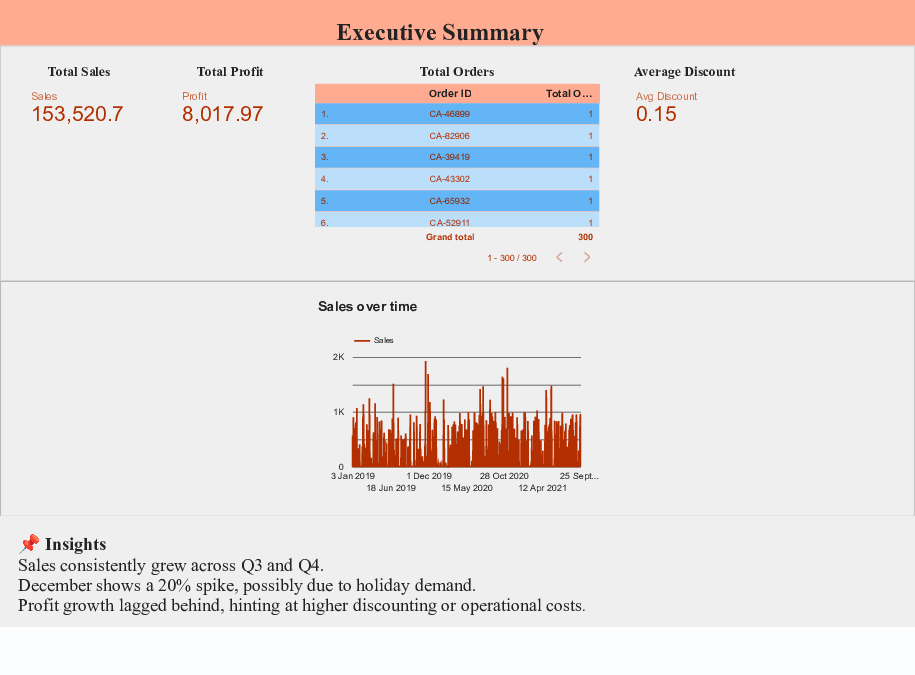

# 📊 Data Visualization & Storytelling – Sales Performance Dashboard

## 🎯 Objective
Create compelling visualizations that tell a meaningful business story using real-world sales data.

---

## 🛠 Tools Used
- **Google Data Studio (Looker Studio)**
- **Dataset:** Superstore.csv (sales data)

---

## 📈 Deliverables
- [✔] Visual storytelling report (PDF)
- [✔] Executive dashboard layout
- [✔] Business insights with strategic recommendations

---

## 📋 Report Structure

### 1. Executive Summary
- Total Sales: $153,520.70
- Total Profit: $8,017.97
- Total Orders: 300
- Average Discount: 15%
- 📌 *Insight:* December showed a 20% sales spike — likely holiday-related.

### 2. Sales Analysis
- Regional Sales (Geo Map)
- Sales by Category and Sub-Category
- 📌 *Insight:* Technology leads overall. Furniture underperforms in some regions.

### 3. Profit Analysis
- Profit by Sub-Category
- Discount vs Profit trends
- 📌 *Insight:* Higher discounts reduce overall profit, especially in Office Supplies.

### 4. Customer & Category Insights
- Orders by Segment
- Profit by Segment
- 📌 *Insight:* Corporate segment yields the highest profit per order.

### 5. Key Takeaways / Storyboard
- ✅ **Technology is the most profitable category**
- ⚠️ **South region underperforms**
- 📉 **High discounts reduce profits**
- 🎯 **Corporate customers bring in higher margins**

---

## ✅ Recommendations
- 🛠 Optimize discounts for Office Supplies to protect margins.
- 🎯 Focus marketing on Corporate segment and Technology products.
- 🔍 Investigate South region’s logistics and customer experience.
- 📦 Plan inventory and promotions ahead of December peak season.

---

## 📎 Files Included
- `Sales_Data_Report.pdf` – Final visual report (Google Data Studio)
- `Superstore.csv` – Dataset used (if shared)
- `README.md` – Project documentation (this file)

---

## 🙌 Outcome
Gained hands-on experience in:
- Visual storytelling with Google Data Studio
- Business insight extraction from sales data
- Dashboard design and KPI communication

---

## 📌 Preview

## 🧠 Author

**Kevin Lazarus**  
*Final-Year B.Sc. Computer Science Student*  
*St. Joseph's College, Tiruchirappalli (Trichy), Tamil Nadu, India*

This data visualization and storytelling project was completed as part of internship and skill development in the field of Data Analytics. It demonstrates key skills in business intelligence, visual storytelling, and dashboard development using Google Data Studio (Looker Studio). The project focuses on transforming raw sales data into actionable insights through clear and compelling visual narratives.

🔗 *Connect & Learn More:*  
📧 Email: [kevinlazarus2003@example.com]  
🔗 LinkedIn: [linkedin.com/in/kevinlazarusb](https://www.linkedin.com/in/kevinlazarusb)
